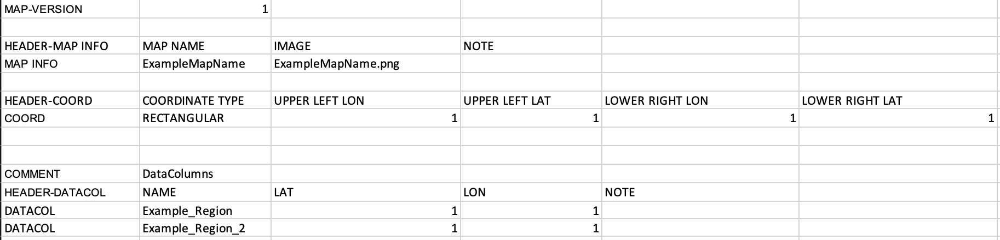

# Server

---

## Setup

---

### assets

---

We set up the assets folder to contain all supporting files. The jars are not found on the public repo since they contain sensitive information on private applications.

```lua
server
`-- assets
    |-- datapacks
    |   |-- *.dpk
    |   |-- *.mdpk
    |   |-- *.map
    |   `-- *.txt
    |-- decrypted
    |   `--[decrypted datapacks]
    |-- jars
    |   | -- TSCreator.jar
    |   ` -- decrypt.jar
    `-- configs.json
```

We keep datapacks used on the server in this folder `assets/datapacks`. The configs.json folder will detail which of this datapacks are to be used in the `activeDatapacks` field.

Again, make sure to denote the name of your jars in their respective fields. EX. (`decryptionJar: "assets/jars/decrypt.jar"`)

`configs.json` contains all the information of where assets are to be used on the server side. This is asserted in `server/src/types.ts`. Any changes to `configs.json` will need to be additionally changed in the `types.ts` files.

---

### public

---

We hold all the service files here for the app. The app is able to access all files so do not put any sensitive information here (including the decrypted datapacks and jars). The presets, mapimages, and charts cache are all located here.

#### public/presets

The presets in `public/presets` will contain specific configurations of certain datapack combinations. The naming convention of these will be `public/presets/*-*` (EX: 001-TSC2020). The `config.json` will hold the information for each preset. **Right now, the settings parser, xml to json, and json to xml functions are not working so the settings are currently default.**

**_Ask Professor Ogg for any preset ideas._**

#### public/charts

This holds the charts in a hashed directory. The hash consists of an `md5` hash of the chart settings and chart datapacks. This ensures that if they request the same chart, we can just use the cached version. Both the chart and settings file used in the java jar are kept here for cache use.

#### public/mapimages

This holds any map images if the datapacks used are those with [map points](#Parse-MapPacks). Everytime the app [requests new datapack info](#get-datapackinfofiles), we delete this directory. The app will service these map images for the settings map points.

---

## Initializing the server

---

### yarn start

On starting the server with `yarn start`, the server will create a fastify server listening on port `3000`

We then `glob` all the presets by parsing each preset in `public/presets`. This is done in `src/preset.ts`. Any error here will simply dismiss that folder/preset and the server will continue running.

After grabbing all the pre-initialized presets we parse the `assets/config.json` file to grab all the correct filepaths and datapacks to be used. Any error in reading this config file will stop the server.

### Datapacks

Datapacks can be unencrypted or encrypted but must be in a certain format for us to be able to display settings correctly. This is what we use `decrypt.jar` for. We give the datapacks parsed from `assets/config.json` and the destination also located in that file for the decrypted packs and decrypt said datapacks. Any errors like a datapack formatted or encrypted wrong will result in the datapack not being decrypted.

Currently there is no error checking for if the datapack was correctly decrypted. However, for future implementation this would be easy since you would just cross reference the datapacks and the decrypted datapack directory. Additionally, images not related to maps will need to be extracted as this is not implemented either.

The end result will have folders within the decryption directory that contain datapacks and mappack info if there are any.

---

After decrypting the datapacks, the server will simply listen for any requests from the app it can fulfill

---

## Routes

---

### GET /charts/:usecache

---

`params`: {usecache (default `false`)}

This will service the function `routes.fetchChart`. If the user decides to use the chart cache, the `GET` request will contain a URL param for `usecache` with string value `true`.

A chart request must be

```js
export type ChartRequest = {
  settings: string, // XML string representing the settings file you want to use to make a chart
  datapacks: string[], // active datapacks to be used on chart
};
```

We hash the `settings` and `datapacks` to check if the chart already exists in `public/charts` if `cache` is true.

If cache is not used or the directory doesn't exist then we make the directory. If any datapacks requested do not exist in `assetconfigs.activeDatapacks` we return a `ServerResponseError`.

After checking datapacks, we proceed to call the java file TSCreator.jar. We call a bash command

```bash
java -Xmx512m -XX:MaxDirectMemorySize=64m -XX:MaxRAM=1g -jar TSCreator.jar -node -s {settings_filepath} -d {datapacks} -o {chart_filepath}
```

We reply to the app with the chart path and hash that we have just used.

### POST /removecache

---

We simply delete `public/charts`. If any error occurs we return `ServerResponseError`

### GET /pdfstatus/:hash

---

`params`: {hash: string}

We check `public/charts/{hash}` for the chart and if it exists and is readable we return true, otherwise false.

**_NOTE: if hash is wrong there is not way of knowing. Will possibly need a fix_**

### GET /datapackinfo/:files

---

`params`: {files: a string of space indented datapack filenames}

#### Parse Datapacks

For all the datapacks in the paramaters return all the column data and any map data along with that. The datapack parsing takes place in `src/parse.ts`.

**_TODO: check if the files passed in the params even exist. What should be the intended action after?_**

We parse the tab indented datapack and fill the data type `ColumnInfo`

```js
export type ColumnInfo = {
  [name: string]: {
    on: boolean,
    children: ColumnInfo | null,
    parents: string[],
  },
};
```

For reference the datapack will consist of parents and children formatted such as

```text
<parents>\t:\t<child>\t<child>\t<child>...
```

Where children can be parents at some point.

General summary of the parsing is as follows:

1. Find all `parents` and `children` and put the pairs in a set called allEntries indexed by `parents`. `children` will be an array of `child`'s that are strings.

2. Iterate over all `parents` keys and for all children put them into a set called `isChild`. This will hold all children that are or will be children.

3. Iterate over `allEntries` keys but skip if the key is in `isChild`. For every key that "isn't" a child, run the recursive function that creates a ColumnInfo variable for the parent and recursively calls for all the children

These steps allow us to create the ColumnInfo variables without any dupes or complications.

#### Parse Mappacks

If the file has any map pack info, the function `grabMapInfo` will parse the required files and create `MapInfo` variables with the information.

```js
export type MapInfo = {
  [name: string]: {
    img: string,
    note?: string,
    parent?: MapInfo[string],
    coordtype: string,
    bounds: Bounds,
    mapPoints: MapPoints,
  },
};
```

**_Currently the MapInfo variable is only working with `Rectangular Coordinates`_**

The decrypt.jar will create in every successful decryption of a datapack a mappack directory that contains any mappack info. If this exists for the datapacks requested, `grabMapInfo` will process it and aggregate it for all the datapacks involved.

The mappack is formatted like



Parsing this is more or less self explanatory. The one nuance that comes up are some of the settings can be present while some do not have to such as note and parent. `Parent` would exist if there is a parent map for the current map we are on. To accomodate these possibilities we parse the names found in the header. We know it's a header if it contains `HEADER` at the beginning. Using these labels at the top as the keys we can create a switch statement that checks all the labels that we know exist.

This same parsing idea is used to fill out MapPoints.

```js
export type MapPoints = {
  [name: string]: {
    lat: number,
    lon: number,
    default?: string,
    minage?: number,
    maxage?: number,
    note?: string,
  },
};
```

This data structure is for the buttons that represent columns on the map itself.

### GET /presets

---

Simple route that sends the presets we generated at the [yarn start](#yarn-start) step
