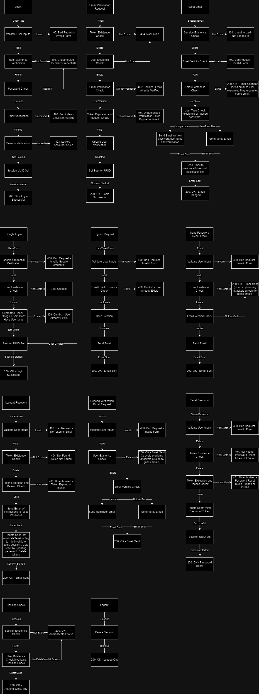
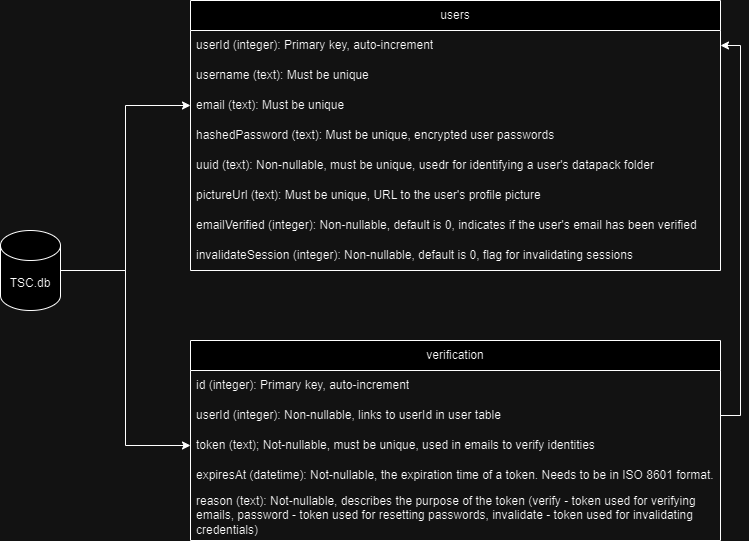

# Server

---

## Setup

---

### assets

---

We set up the assets folder to contain all supporting files. The jars are not found on the public repo since they contain sensitive information on private applications.

```lua
server
`-- assets
    |-- datapacks
    |   |-- *.dpk
    |   |-- *.mdpk
    |   |-- *.map
    |   `-- *.txt
    |-- decrypted
    |   `--[decrypted datapacks]
    |-- uploads
    |   `--[uuid]
    |       `--datapacks
    |-- jars
    |   | -- TSCreator.jar
    |   ` -- decrypt.jar
    |-- adminconfig.json
    `-- configs.json
```

We keep datapacks used on the server in this folder `assets/datapacks`. The configs.json folder will detail which of this datapacks are to be used in the `activeDatapacks` field.

Again, make sure to denote the name of your jars in their respective fields. EX. (`decryptionJar: "assets/jars/decrypt.jar"`)

`configs.json` contains all the information of where assets are to be used on the server side. This is asserted in `server/src/types.ts`. Any changes to `configs.json` will need to be additionally changed in the `types.ts` files.

`uploads` directory contains all the user uploaded datapacks

`assetconfig.json` contains all the added configurations any admin user uploads

---

### public

---

We hold all the service files here for the app. The app is able to access all files so do not put any sensitive information here (including the decrypted datapacks and jars). The presets, mapimages, and charts cache are all located here.

#### public/presets

The presets in `public/presets` will contain specific configurations of certain datapack combinations. The naming convention of these will be `public/presets/*-*` (EX: 001-TSC2020). The `config.json` will hold the information for each preset. **Right now, the settings parser, xml to json, and json to xml functions are not working so the settings are currently default.**

**_Ask Professor Ogg for any preset ideas._**

#### public/charts

This holds the charts in a hashed directory. The hash consists of an `md5` hash of the chart settings and chart datapacks. This ensures that if they request the same chart, we can just use the cached version. Both the chart and settings file used in the java jar are kept here for cache use.

#### public/mapimages

This holds any map images if the datapacks used are those with [map points](#Parse-MapPacks). There is currently no cleanup here.

---

## Initializing the server

---

### yarn start

On starting the server with `yarn start`, the server will create a fastify server listening on port `3000`

We then `glob` all the presets by parsing each preset in `public/presets`. This is done in `src/preset.ts`. Any error here will simply dismiss that folder/preset and the server will continue running.

After grabbing all the pre-initialized presets we parse the `assets/config.json` file to grab all the correct filepaths and datapacks to be used. Any error in reading this config file will stop the server.

### Session

The session key represents the user's session. This is a random string that is generated when the user logs in. The `fastify-secure-session` plugin is used to create a session for the user. This session is stored in the `session` cookie. The session is used to authenticate the user and to store the user's information. The session key stores the uuid of the user as well so we can easily attach the user to the session.

This allows the user to stay logged in even if they refresh the page. This also allows us to verify that the user is logged in and to get the user's potentially confidential information.

Session keys will last for 1 week. After 1 week, the user will be logged out and will have to log in again.

### Datapacks

Datapacks can be unencrypted or encrypted but must be in a certain format for us to be able to display settings correctly. This is what we use `decrypt.jar` for. We give the datapacks parsed from `assets/config.json` and the destination also located in that file for the decrypted packs and decrypt said datapacks. Any errors like a datapack formatted or encrypted wrong will result in the datapack not being decrypted.

The end result will have folders within the decryption directory that contain datapacks and mappack info if there are any.

---

After decrypting the datapacks, the server will simply listen for any requests from the app it can fulfill

---

### Admin Config

The server holds `DatapackMetadata` which describes multiple facets and characteristics of the datapacks. See below

```js
export type DatapackMetadata = {
  description: string,
  title: string,
  file: string,
  size: string,
  date?: string,
  authoredBy: string,
  tags: string[],
  references: string[],
  contact?: string,
  notes?: string,
};
```

However, we want to keep the repo a shell. This means that the repo will not contain any predetermined datapacks. The server will then have a .gitignored `admin-config.json` that will hold all the metadata for the datapacks. This will be used to populate the `DatapackMetadata` for the server.

The config that we have on command if we want to populate it is stored in `dev-config.json`. This is the config that we will use to populate the `admin-config.json` file.

To run this you will run `yarn dev:config` in `server`.

This will run a script to add the datapack metadata in `dev-config.json` to `admin-config.json`. This will **NOT** add any datapacks to `asset/datapacks` or `assets/decrypted`.

You will need to download the datapacks yourself and run `yarn start` to decrypt them properly (assuming the files are correct)

## File Metadata

The server will store the metadata of any uploaded files in `file-metdata.json` in `server/assets`.

This metadata will be in the form

```js
export type FileMetadataIndex = {
  [filepath: string]: FileMetadata,
};
export type FileMetadata = {
  fileName: string,
  lastUpdated: string,
  decryptedFilepath: string,
  mapPackIndexFilepath: string,
  datapackIndexFilepath: string,
};
```

This is done so that we can easily access when the file was last used/updated and where all its information is stored. Once `lastUpdated` becomes stale (after 2 weeks) the server will delete the file and its metadata.

This is **NOT** to be confused with `DatapackMetadata` which is specifically for characterizing the datapacks and map packs.

**NOTE**: If the file is updated when a user uses it for chart generation and the server's `FileMetadata` does not have an entry for that uploaded file, an error is thrown. Therefore, if the file exists and is not in metadata, manual cleanup is required. However, if the file does not exist and the metadata says that it exists, the server will check it's existence and remove the metadata if it does not exist.

## User Endpoints

### Fetch Chart

- **Endpoint:** `/charts`
- **Method:** `POST`
- **Description:** Fetch the chart image for the given settings and datapacks
- **Requires Valid Session:** No

#### Request Body

| Name      | Type    | Description                                                                                    | Required |
| --------- | ------- | ---------------------------------------------------------------------------------------------- | -------- |
| settings  | string  | The settings for the chart in xml format.                                                      | Yes      |
| datapacks | string  | The datapacks to use for the chart.                                                            | Yes      |
| useCache  | boolean | Whether to use the cache or not. If `true`, the server will use the cached chart if it exists. | Yes      |

#### Example Request

```http
POST /charts/false HTTP/1.1
Content-Type: application/json
Host: dev.timescalecreator.org
{
  "settings": "<xml>[settings]</xml>",
  "datapacks": ["datapack1", "datapack2"],
  "useCache": true
}
```

#### Example Response

```json
{
  "chart": "https://dev.timescalecreator.org/charts/72309213/chart.png"
}
```

#### Error Responses

- **Status Code:** `400 Bad Request`
- **Content-Type:** `application/json`
- **Description:** Returned if the request body is invalid

```json
{
  "error": "ERROR: chart request is not valid. Error was: ..."
}
```

- **Status Code:** `503 Service Unavailable`
- **Content-Type:** `application/json`
- **Description:** If the queue is full, the server will return this error (IMPORTANT because the java file takes around 2GB of RAM and server is limited to ~16 GB at the moment)

```json
{
  "error": "Server is too busy. Please try again later."
}
```

- **Status Code:** `408 Request Timeout`
- **Content-Type:** `application/json`
- **Description:** Returned if the chart generation takes too long

```json
{
  "error": "Request timed out"
}
```

- **Status Code:** `500 Internal Server Error`
- **Content-Type:** `application/json`
- **Description:** Returned if the server encounters an error while generating the chart. Could also return if the server is unable to save the chart, or the java file failed.

```json
{
  "error": "Internal server error"
}
```

---

### Fetch Timescale

- **Endpoint:** `/timescale`
- **Method:** `GET`
- **Description:** Fetch the timescale data that holds all the ages/stages of Earth
- **Requires Valid Session:** No

#### Example Request

```http
GET /timescale HTTP/1.1
Host: dev.timescalecreator.org
```

#### Example Response

```json
{
  "timescaleData": [
    {
      "key": "Holocene",
      "value": 0
    },
    {
      "key": "Lt. Pleistocene",
      "value": 0.126
    }
  ]
}
```

#### Error Responses

- **Status Code:** `500 Internal Server Error`
- **Content-Type:** `application/json`
- **Description:** Returned if the server encounters an error while fetching the timescale data or it cannot read the excel file

```json
{
  "error": "Internal server error"
}
```

- **Status Code:** `404 Not Found`
- **Content-Type:** `application/json`
- **Description:** Returned if the server cannot find the excel file

```json
{
  "error": "Excel file not found"
}
```

---

### Facies Patterns

- **Endpoint:** `/facies-patterns`
- **Method:** `GET`
- **Description:** Fetch the facies patterns data that holds all the facies patterns (loaded on server startup)
- **Requires Valid Session:** No

#### Example Request

```http
GET /facies-patterns HTTP/1.1
Host: dev.timescalecreator.org
```

#### Example Response

```json
{
  "patterns": {
    ["Limestone"]: {
      "name": "Limestone",
      "formattedName": "Limestone",
      "filepath": "public/facies-patterns/Limestone.png",
      "color": {
        "name": "Red",
        "hex": "#FF0000",
        "rgb": "rgb(255, 0, 0)"
      }
    },
    ["Sandstone"]: {
      "name": "Sandstone",
      "formattedName": "Sandstone",
      "filepath": "public/facies-patterns/Sandstone.png",
      "color": {
        "name": "Green",
        "hex": "#00FF00",
        "rgb": "rgb(0, 255, 0)"
      }
    }
  }
}
```

#### Error Responses

- **Status Code:** `500 Internal Server Error`
- **Content-Type:** `application/json`
- **Description:** Returned if the server doesn't load the facies patterns on startup

```json
{
  "error": "Servver isn't able to load facies patterns"
}
```

---

### Fetch Image

- **Endpoint:** `/images/:datapackName/:imageName`
- **Method:** `GET`
- **Description:** Fetch the image for the given datapack and image name

#### Parameters

| Name         | Type   | Description              | Required |
| ------------ | ------ | ------------------------ | -------- |
| datapackName | string | The name of the datapack | Yes      |
| imageName    | string | The name of the image    | Yes      |

#### Example Request

```http
GET /images/TSC2020/image.png HTTP/1.1
Host: dev.timescalecreator.org
```

#### Example Response

```json
{
  "image": "images/TSC2020/image.png"
}
```

#### Error Responses

- **Status Code:** `404 Not Found`
- **Content-Type:** `application/json`
- **Description:** Returned if the server cannot find the image

```json
{
  "error": "Image not found"
}
```

- **Status Code:** `403 Forbidden`
- **Content-Type:** `application/json`
- **Description:** Returned if the filepath goes outside the allowed directory

```json
{
  "error": "Invalid image path"
}
```

---

### User Datapacks

- **Endpoint:** `/user-datapacks`
- **Method:** `GET`
- **Description:** Fetch the user's datapacks
- **Requires Valid Session:** Yes

#### Example Request

```http
GET /user-datapacks HTTP/1.1
Host: dev.timescalecreator.org
Cookie: loginSession=123
```

#### Example Response

```json
{
  "datapackIndex": {
    ["TSC2020"]: {
      "<DatapackParsingPack>"
    },
    ["TSC2021"]: {
      "<DatapackParsingPack>"
    }
  },
  "mapPackIndex": {
    ["TSC2020"]: {
      "<MapPack>"
    },
    ["TSC2021"]: {
      "<MapPack>"
    }
  }
}
```

#### Error Responses

- **Status Code:** `401 Unauthorized`
- **Content-Type:** `application/json`
- **Description:** Returned if the user is not logged in

```json
{
  "error": "User not logged in"
}
```

- **Status Code:** `404 Not Found`
- **Content-Type:** `application/json`
- **Description:** Returned if the user has no datapacks

```json
{
  "error": "User has no uploaded datapacks"
}
```

- **Status Code:** `500 Internal Server Error`
- **Content-Type:** `application/json`
- **Description:** Returned if the server encounters an error while fetching and/or reading the user's datapacks

```json
{
  "error": "Failed to load indexes, corrupt json files present. Please contact customer service."
}
```

---

### Server Datapack Info (Chunks)

- **Endpoint:** `/datapack-index`
- **Method:** `GET`
- **Description:** Fetch the server's datapack info (in chunks)
- **Requires Valid Session:** No
- **Note:** This is used to fetch all the datapacks on the server in chunks. The server will return the total number of chunks and the datapacks in the requested chunk. Chunks are requested by the `start` and `increment` query parameters. They also signify datapacks to fetch (one datapack = one chunk).

#### Query Parameters

| Name      | Type   | Description                                             | Required |
| --------- | ------ | ------------------------------------------------------- | -------- |
| start     | number | The starting index of the chunk to fetch (default is 0) | No       |
| increment | number | The increment of the chunk to fetch (default is 1)      | No       |

#### Example Request

```http
GET /datapack-index?start=0&increment=1 HTTP/1.1
Host: dev.timescalecreator.org
```

#### Example Response

```json
{
  "datapackIndex": {
    ["TSC2020"]: {
      "<DatapackParsingPack>"
    }
  },
  "totalChunks": 10
}
```

#### Error Responses

- **Status Code:** `500 Internal Server Error`
- **Content-Type:** `application/json`
- **Description:** Returned if the server encounters an error while fetching and/or reading the datapacks

```json
{
  "error": "Failed to load datapack"
}
```

- **Status Code:** `404 Not Found`
- **Content-Type:** `application/json`
- **Description:** Returned if the server has no datapacks at the requested chunks

```json
{
  "error": "No datapacks found"
}
```

---

### Server MapPack Info (Chunks)

- **Endpoint:** `/map-pack-index`
- **Method:** `GET`
- **Description:** Fetch the server's map pack info (in chunks)
- **Requires Valid Session:** No
- **Note:** This is used to fetch all the map packs on the server in chunks. The server will return the total number of chunks and the map packs in the requested chunk. Chunks are requested by the `start` and `increment` query parameters. They also signify map packs to fetch (one map pack = one chunk).

#### Query Parameters

| Name      | Type   | Description                                             | Required |
| --------- | ------ | ------------------------------------------------------- | -------- |
| start     | number | The starting index of the chunk to fetch (default is 0) | No       |
| increment | number | The increment of the chunk to fetch (default is 1)      | No       |

#### Example Request

```http
GET /map-pack-index?start=0&increment=1 HTTP/1.1
Host: dev.timescalecreator.org
```

#### Example Response

```json
{
  "mapPackIndex": {
    ["TSC2020"]: {
      "<MapPack>"
    }
  },
  "totalChunks": 10
}
```

#### Error Responses

- **Status Code:** `500 Internal Server Error`
- **Content-Type:** `application/json`
- **Description:** Returned if the server encounters an error while fetching and/or reading the map packs

```json
{
  "error": "Failed to load map pack"
}
```

- **Status Code:** `404 Not Found`
- **Content-Type:** `application/json`
- **Description:** Returned if the server has no map packs at the requested chunks

```json
{
  "error": "No map packs found"
}
```

---

### Remove Cache

- **Endpoint:** `/removecache`
- **Method:** `POST`
- **Description:** Removes the cache for the charts
- **Requires Valid Session:** No

#### Example Request

```http
POST /removecache HTTP/1.1
Host: dev.timescalecreator.org
```

#### Example Response

```json
{
  "message": "Directory public/charts successfully deleted"
}
```

---

### Svg Status

- **Endpoint:** `/svgstatus/:hash`
- **Method:** `GET`
- **Description:** Check the readiness of the svg file identified by the hash
- **Requires Valid Session:** No

#### Parameters

| Name | Type   | Description          | Required |
| ---- | ------ | -------------------- | -------- |
| hash | string | Hash of the svg file | Yes      |

#### Example Request

```http
POST /svgstatus/72309213 HTTP/1.1
Host: dev.timescalecreator.org
```

#### Example Response

```json
{
  "ready": true
}
```

#### Error Responses

- **Status Code:** `403 Forbidden`
- **Content-Type:** `application/json`
- **Description:** Returned if the hash is invalid or the filepath goes outside the allowed directory

```json
{
  "message": "Invalid hash"
}
```

- **Status Code:** `404 Not Found`
- **Content-Type:** `application/json`
- **Description:** Returned if no directory is found for the hash

```json
{
  "message": "No directory exists at hash: 72309213"
}
```

### Fetch Settings XML

- **Endpoint:** `/settingsXml/:file`
- **Method:** `GET`
- **Description:** Fetch the settings xml file requested
- **Requires Valid Session:** No

#### Parameters

| Name | Type   | Description               | Required |
| ---- | ------ | ------------------------- | -------- |
| file | string | Name of the settings file | Yes      |

#### Example Request

```http
GET /settingsXml/public/presets/001-TSC2020/settings.xml HTTP/1.1
Host: dev.timescalecreator.org
```

#### Example Response

```xml
<?xml version="1.0" encoding="UTF-8"?>
<settings>
  <setting>
    <name>setting1</name>
    <value>value1</value>
  </setting>
  <setting>
    <name>setting2</name>
    <value>value2</value>
  </setting>
```

#### Error Responses

- **Status Code:** `404 Not Found`
- **Content-Type:** `application/json`
- **Description:** Returned if the file is not found

```json
{
  "error": "File not found"
}
```

---
### Download User-Datapacks

- **Endpoint:** `/user/datapack/:filename`
- **Method:** `GET`
- **Description:** Download the user's datapacks. If the user chooses `Encrypted Download`, the encrypted file will be downloaded. Otherwise, the original file will be downloaded.
- **Requires Valid Session:** Yes

#### Parameter

| Name           | Type    | Description                                                  | Required |
| -------------  | ------- | ------------------------------------------------------------ | -------- |
| filename       | string  | The name of the file that needs to be downloaded             | Yes      |

#### Query Parameter

| Name           | Type    | Description                                                  | Required |
| -------------  | ------- | ------------------------------------------------------------ | -------- |
| needEncryption | boolean | Whether need to encrypt the file                             | No       |


#### Example Request

```http
GET /user/datapack/defaultDatapack?needEncryption=true HTTP/1.1
Host: dev.timescalecreator.org
Cookie: loginSession=123
```

#### Example Response

```blob
  <Binary data of the file>
```

#### Error Responses
- **Status Code:** `401 Unauthorized`
- **Content-Type:** `application/json`
- **Description:** Returned if the user is not logged in

```json
{
  "error": "User not logged in"
}
```

- **Status Code:** `403 Forbidden`
- **Content-Type:** `application/json`
- **Description:** Returned if the filepath is not valid

```json
{
  "error": "Invalid file path"
}
```

- **Status Code:** `404 Not Found`
- **Content-Type:** `application/json`
- **Description:** Returned if the file requested is not found

```json
{
  "error": "The file requested <filename> does not exist within user's upload directory"
}
```

- **Status Code:** `500 Internal Server Error`
- **Content-Type:** `application/json`
- **Description:** Returned if the encryption process failed

```json
{
  "error": "Failed to encrypt datapacks with error <error>"
}
```

- **Status Code:** `500 Internal Server Error`
- **Content-Type:** `application/json`
- **Description:** Returned if failed to create encrypted directory for the user

```json
{
  "error": "Failed to create encrypted directory with error <error>"
}
```

- **Status Code:** `422 Unprocessable Content`
- **Content-Type:** `application/json`
- **Description:** Returned if Java file failed to generate the correct encrypted file

```json
{
  "error": "Java file was unable to encrypt the file <filename>, resulting in an incorrect encryption header"
}
```

---

## Admin Endpoints

This section will detail all the admin endpoints that are available to the admin user. All these endpoints require a valid session to be used and a recaptcha token to be passed in the headers.

### General Request Headers/Requirements for the route

| Name      | Type   | Description                                                                                                       | Required |
| --------- | ------ | ----------------------------------------------------------------------------------------------------------------- | -------- |
| recaptcha | string | The recaptcha token to verify the user is not a bot.                                                              | Yes      |
| session   | string | The session token to verify the user is logged in. which will also connect the user to their uuid in the database | Yes      |

### Example Base Request

```http
POST /admin/users HTTP/1.1
Host: dev.timescalecreator.org
recaptcha: 123
Cookie: loginSession=123
```

### General Error Responses

- **Status Code:** `401 Unauthorized`
- **Content-Type:** `application/json`
- **Description:** Returned if the user is not an admin, not an existing user, or the session is invalid/nonexistent

```json
{
  "error": "Unauthorized Access"
}
```

- **Status Code:** `400 Bad Request`
- **Content-Type:** `application/json`
- **Description:** Returned if the request header is missing the recaptcha token

```json
{
  "error": "Missing recaptcha token"
}
```

- **Status Code:** `422 Unprocessable Entity`
- **Content-Type:** `application/json`
- **Description:** Returned if the recaptcha token is invalid

```json
{
  "error": "Invalid recaptcha token"
}
```

---

### Fetch Users

- **Endpoint:** `/admin/users`
- **Method:** `POST`
- **Description:** Fetch all the users
- **Requires Valid Session:** Yes
- **NOTE** We choose POST so we have more data available to send as the user's increase (GET requests are limited compared to POST)

#### Example Request

```http
POST /admin/users HTTP/1.1
Host: dev.timescalecreator.org
recaptcha: 123
Cookie: loginSession=123
```

#### Example Response

```json
{
  "users": [
    {
      "uuid": "123",
      "userId": "user1",
      "email": "user@gmail.com",
      "username": "user1",
      "emailVerified": true,
      "invalidateSession": false,
      "isGoogleUser": false,
      "isAdmin": false,
      "pictureUrl": "https://www.google.com"
    }
  ]
}
```

---

### Create User

- **Endpoint:** `/admin/user`
- **Method:** `POST`
- **Description:** Create a user
- **Requires Valid Session:** Yes

#### Request Body

| Name       | Type    | Description                                        | Required |
| ---------- | ------- | -------------------------------------------------- | -------- |
| email      | string  | The email for the user                             | Yes      |
| password   | string  | The password for the user                          | Yes      |
| username   | string  | The username for the user                          | No       |
| pictureUrl | string  | The picture url for the user                       | No       |
| isAdmin    | boolean | Whether the user is an admin (Defaults to "false") | No       |

#### Example Request

```http
POST /admin/user HTTP/1.1
Host: dev.timescalecreator.org
recaptcha: 123
Cookie: loginSession=123
{
  "username": "user1",
  "password": "password1",
  "email": "email1",
  "pictureUrl": "google.com",
  "isAdmin": "true"
}
```

#### Example Response

```json
{
  "message": "User created"
}
```

#### Error Responses

---

#### Parse Datapacks

For all the datapacks in the paramaters return all the column data and any map data along with that. The datapack parsing takes place in `src/parse.ts`.

**_TODO: check if the files passed in the params even exist. What should be the intended action after?_**

We parse the tab indented datapack and fill the data type `ColumnInfo`

```js
export type ColumnInfo = {
  [name: string]: {
    on: boolean,
    children: ColumnInfo | null,
    parents: string[],
  },
};
```

For reference the datapack will consist of parents and children formatted such as

```text
<parents>\t:\t<child>\t<child>\t<child>...
```

Where children can be parents at some point.

General summary of the parsing is as follows:

1. Find all `parents` and `children` and put the pairs in a set called allEntries indexed by `parents`. `children` will be an array of `child`'s that are strings.

2. Iterate over all `parents` keys and for all children put them into a set called `isChild`. This will hold all children that are or will be children.

3. Iterate over `allEntries` keys but skip if the key is in `isChild`. For every key that "isn't" a child, run the recursive function that creates a ColumnInfo variable for the parent and recursively calls for all the children

These steps allow us to create the ColumnInfo variables without any dupes or complications.

#### Parse Mappacks

If the file has any map pack info, the function `grabMapInfo` will parse the required files and create `MapInfo` variables with the information.

```js
export type MapInfo = {
  [name: string]: {
    img: string,
    note?: string,
    parent?: MapInfo[string],
    coordtype: string,
    bounds: Bounds,
    mapPoints: MapPoints,
  },
};
```

**_Currently the MapInfo variable is only working with `Rectangular Coordinates`_**

The decrypt.jar will create in every successful decryption of a datapack a mappack directory that contains any mappack info. If this exists for the datapacks requested, `grabMapInfo` will process it and aggregate it for all the datapacks involved.

The mappack is formatted like


Parsing this is more or less self explanatory. The one nuance that comes up are some of the settings can be present while some do not have to such as note and parent. `Parent` would exist if there is a parent map for the current map we are on. To accomodate these possibilities we parse the names found in the header. We know it's a header if it contains `HEADER` at the beginning. Using these labels at the top as the keys we can create a switch statement that checks all the labels that we know exist.

This same parsing idea is used to fill out MapPoints.

```js
export type MapPoints = {
  [name: string]: {
    lat: number,
    lon: number,
    default?: string,
    minage?: number,
    maxage?: number,
    note?: string,
  },
};
```

This data structure is for the buttons that represent columns on the map itself.

### Login Routes

---

This flowchart shows all the current flows for the login routes:



### Database Structure:

---


